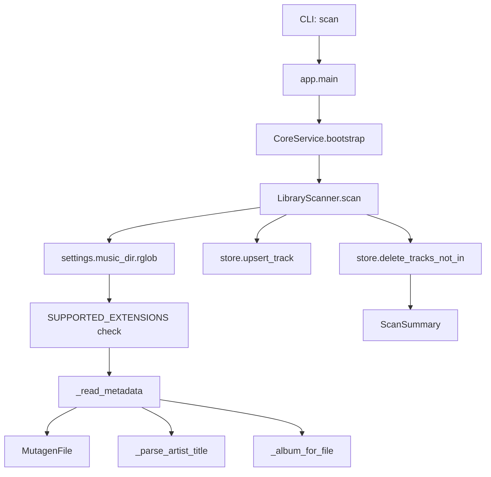
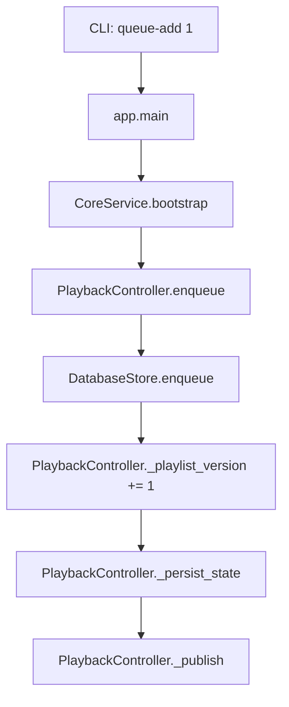
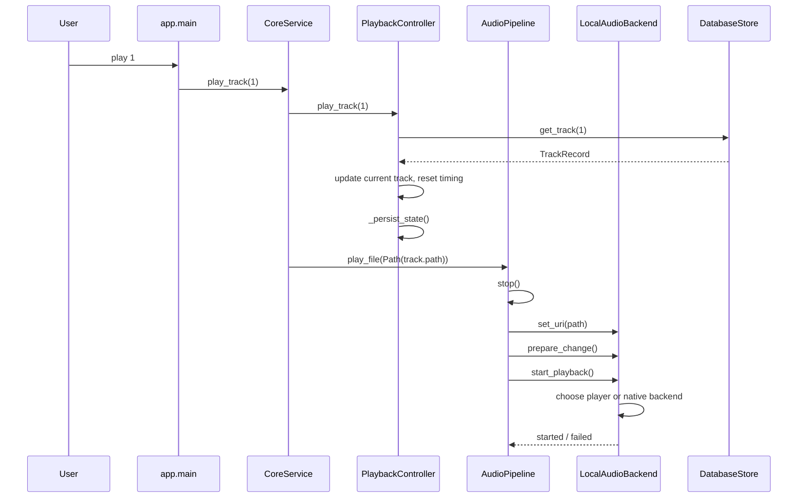
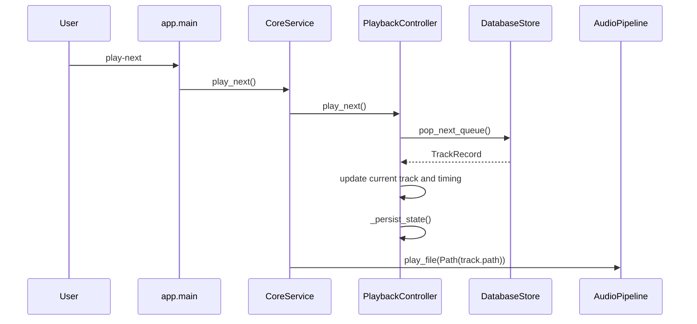
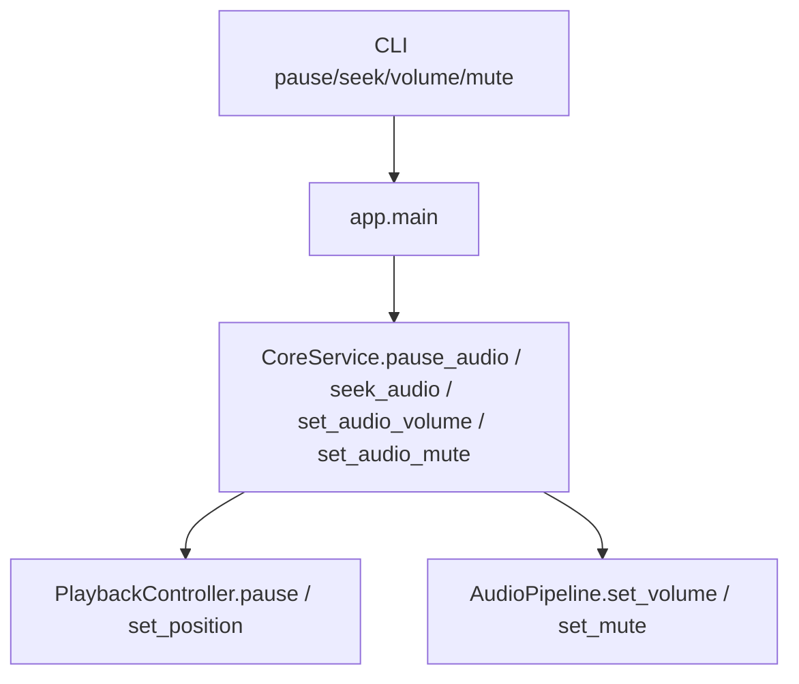
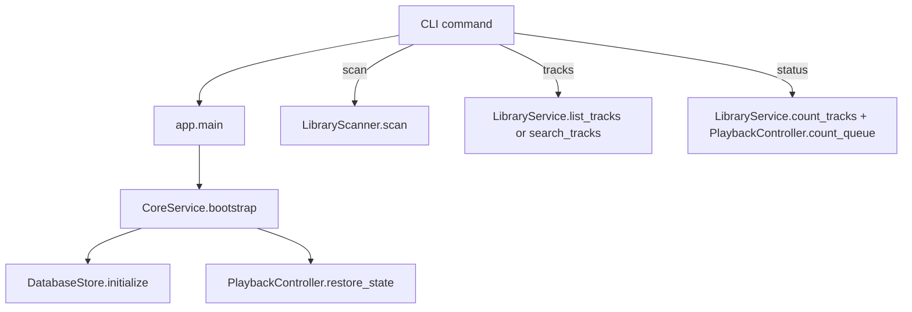
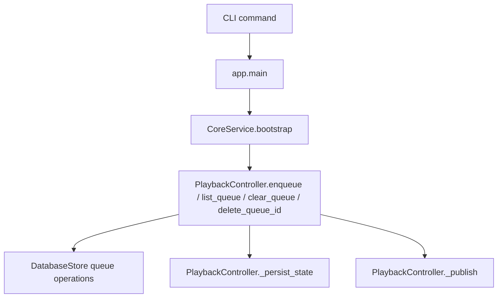
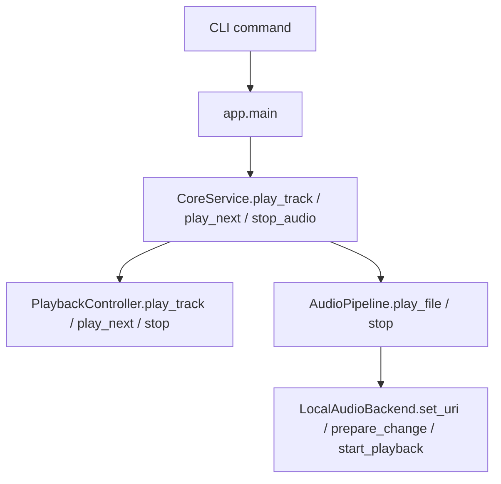
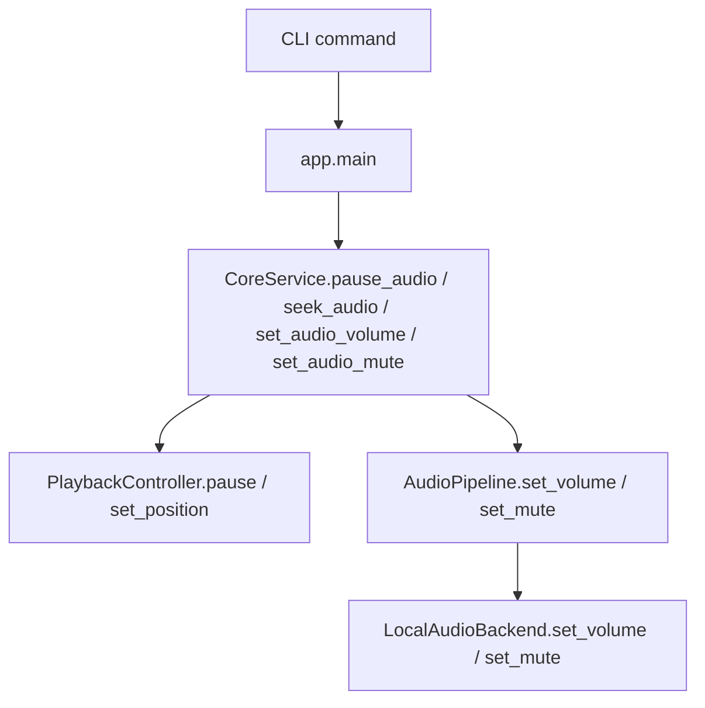
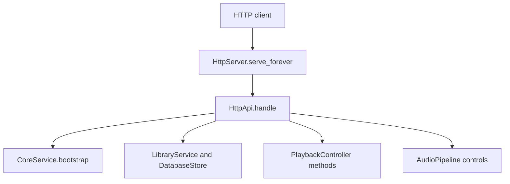

# Development Guide

This document explains the application flow end to end, including the main modules, the function call chain for each major action, and the runtime path from CLI input to playback or MPD output.

The project is intentionally simple: a single-user, localhost-oriented music server with local file scanning, queue management, playback state, and an MPD-compatible protocol server.

## 1. Architecture overview

The main runtime pieces are:

- [src/music_server/app.py](src/music_server/app.py): CLI entry point
- [src/music_server/core/service.py](src/music_server/core/service.py): top-level orchestration
- [src/music_server/library/service.py](src/music_server/library/service.py): read access to the indexed library
- [src/music_server/playback/player.py](src/music_server/playback/player.py): queue and playback state controller
- [src/music_server/audio/pipeline.py](src/music_server/audio/pipeline.py): thin playback API over the backend
- [src/music_server/audio/backend.py](src/music_server/audio/backend.py): audio backend implementation
- [src/music_server/scanner/scanner.py](src/music_server/scanner/scanner.py): library scan and metadata extraction
- [src/music_server/mpd/server.py](src/music_server/mpd/server.py): MPD-compatible TCP server
- [src/music_server/database/store.py](src/music_server/database/store.py): SQLite persistence
- [src/music_server/config/settings.py](src/music_server/config/settings.py): environment-driven configuration

## 2. Startup and bootstrap flow

The first important path is application startup.

### Flow

```mermaid
flowchart TD
    A[CLI command: start/init-db/status/scan] --> B[app.main]
    B --> C[load_settings]
    B --> D[CoreService(settings)]
    D --> E[DatabaseStore]
    D --> F[LibraryScanner]
    D --> G[LibraryService]
    D --> H[PlaybackController]
    D --> I[AudioPipeline]

    B --> J{command}
    J -->|init-db| K[CoreService.bootstrap]
    J -->|scan| K
    J -->|status| K
    J -->|start| K

    K --> L[settings.data_dir.mkdir]
    K --> M[store.initialize]
    K --> N[playback.restore_state]
```

### Function chain

- app.main
- CoreService.__init__
- CoreService.bootstrap
- DatabaseStore.initialize
- PlaybackController.restore_state

### Notes

- bootstrap creates the data directory, initializes SQLite, and restores the saved playback state if present.
- The app is designed to be restarted safely without losing the basic persistence layer.

## 3. Scan and index a music library

The scan command walks the configured music directory, extracts metadata, and updates the database.

### Flow



### Function chain

- app.main
- CoreService.bootstrap
- LibraryScanner.scan
- LibraryScanner._read_metadata
- LibraryScanner._parse_artist_title
- LibraryScanner._album_for_file
- LibraryScanner._stable_uri_for_file
- DatabaseStore.upsert_track
- DatabaseStore.delete_tracks_not_in

### Important detail

The scanner uses Mutagen for metadata extraction and falls back to filename-based values when tags are missing.

## 4. Queue a song

Queueing a song adds it to the SQLite-backed queue.

### Flow



### Function chain

- app.main
- CoreService.bootstrap
- PlaybackController.enqueue
- DatabaseStore.enqueue
- PlaybackController._persist_state
- PlaybackController._publish

## 5. How playing a song works

This is the central runtime path. It has two layers:

1. the queue/playback state layer
2. the audio backend layer

### Flow



### Function chain

- app.main
- CoreService.play_track
- PlaybackController.play_track
- DatabaseStore.get_track
- PlaybackController._persist_state
- AudioPipeline.play_file
- AudioPipeline.stop
- LocalAudioBackend.set_uri
- LocalAudioBackend.prepare_change
- LocalAudioBackend.start_playback

### What happens inside the backend

The backend takes one of two paths:

- if a configured player is present, it launches it through subprocess.Popen
- otherwise it tries the native Python audio path using soundfile and sounddevice

The important distinction is that playback control is split between:

- PlaybackController: queue selection and playback state
- AudioPipeline / LocalAudioBackend: actual audio output

## 6. How play-next works

The play-next command uses the queue directly.

### Flow



### Function chain

- app.main
- CoreService.play_next
- PlaybackController.play_next
- DatabaseStore.pop_next_queue
- PlaybackController._persist_state
- AudioPipeline.play_file

## 7. Pause, seek, volume, and mute

These controls currently operate mostly through playback state rather than the underlying backend.

### Flow



### Function chain

- app.main
- CoreService.pause_audio
- PlaybackController.pause
- CoreService.seek_audio
- PlaybackController.set_position
- CoreService.set_audio_volume
- AudioPipeline.set_volume
- CoreService.set_audio_mute
- AudioPipeline.set_mute

### Current behavior note

- pause and seek are currently tracked in PlaybackController.
- start/stop/volume/mute are routed to the audio pipeline and backend.

## 8. Command-family diagrams

The previous sections already covered the main paths, but the same runtime can be grouped by command family for easier reference.

### 8.1 Library commands: init-db, scan, tracks, status



### 8.2 Queue commands: queue-add, queue, queue-clear, deleteid



### 8.3 Playback commands: play, play-next, stop



### 8.4 Control commands: pause, seek, volume, mute



### 8.5 HTTP routes: status, scan, queue, playback, now-playing



## 9. Persistence model

The app persists two concepts:

- tracks: indexed music files and metadata
- queue state: pending queue items and playback state

The state is written to SQLite and to a JSON playback-state file.

### Key persistence points

- DatabaseStore.upsert_track
- DatabaseStore.enqueue
- PlaybackController._persist_state
- PlaybackController.restore_state

## 10. Quick mental model

If you want the shortest possible explanation of the runtime:

1. The CLI parses input in app.main.
2. The CLI delegates to CoreService.
3. CoreService uses PlaybackController for queue and state.
4. CoreService uses AudioPipeline for actual audio output.
5. The HTTP server routes API requests through the same CoreService and PlaybackController path.

That is the backbone of the application.
